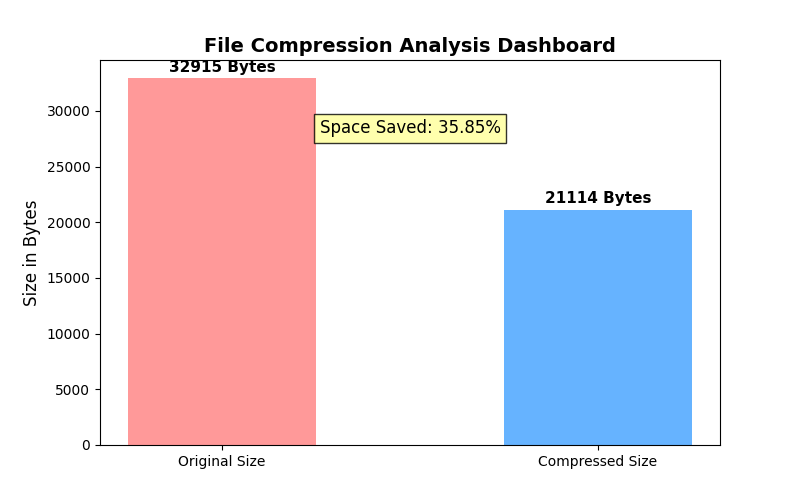

# 🚀 Dynamic File Compression Utility


An industry-oriented, advanced command-line utility built in Python that dynamically compresses and decompresses text files at the bit level. It implements **Huffman Coding** (a greedy algorithm) to guarantee 100% lossless data compression, significantly reducing storage space.

---

## 📊 Compression Dashboard (Live Result)

Here is the visual representation of the compression achieved by the utility:

> **Note:** The image below is auto-generated by the script using `matplotlib` to compare file sizes.



---

## 🎯 Key Features

- **✅ Lossless Compression:** Ensures zero data loss during the compression and decompression lifecycle.
- **🧠 Advanced DSA Application:** Real-world implementation of Hash Maps, Min-Heaps (Priority Queues), and Binary Trees.
- **⚡ Bit-level Packing:** Handles byte-padding natively without relying on external compression libraries.
- **📊 Visual Dashboard:** Automatically generates a Bar Chart comparing original vs. compressed file sizes.
- **📝 Professional Logging:** Auto-generates simulated server activity logs for extensive testing and outputs detailed text reports.
- **📁 Automated Workspace:** Dynamically creates required input, output, and asset directories upon execution.

---

## 📂 Project Architecture

```text
Dynamic-File-Compression-Utility/
│
├── input_files/          # Contains the raw text/log files to be compressed
├── compressed_files/     # Stores the encoded binary (.bin) and metadata (.json)
├── decompressed_files/   # Stores the fully recovered original files
├── outputs/              # Text-based compression stats and reports (compression_report.txt)
├── images/               # Auto-generated visualization dashboards (compression_dashboard.png)
├── .gitignore            # Git ignore configurations
├── main.py               # Core application logic
└── README.md             # Project documentation
🛠️ Installation & Usage
1. Clone the repository:

Bash
git clone https://github.com/dalimkumar452-sudo/Dynamic-File-Compression-Utility.git
2. Install dependencies (for dashboard generation):

Bash
pip install matplotlib
3. Run the application:

Bash
python main.py
4. Follow the CLI Prompts:

Press Enter to use the auto-generated professional system log file, or type the path to your custom .txt file.

Type y when prompted to verify the decompression process.

👨‍💻 About The Developer
Dalim Kumar Software Developer & Engineering Student GitHub Profile

Built as a comprehensive Proof of Work for Data Structures, Algorithms, and System Programming.

⭐ If you found this project helpful or interesting, please consider giving it a star!
